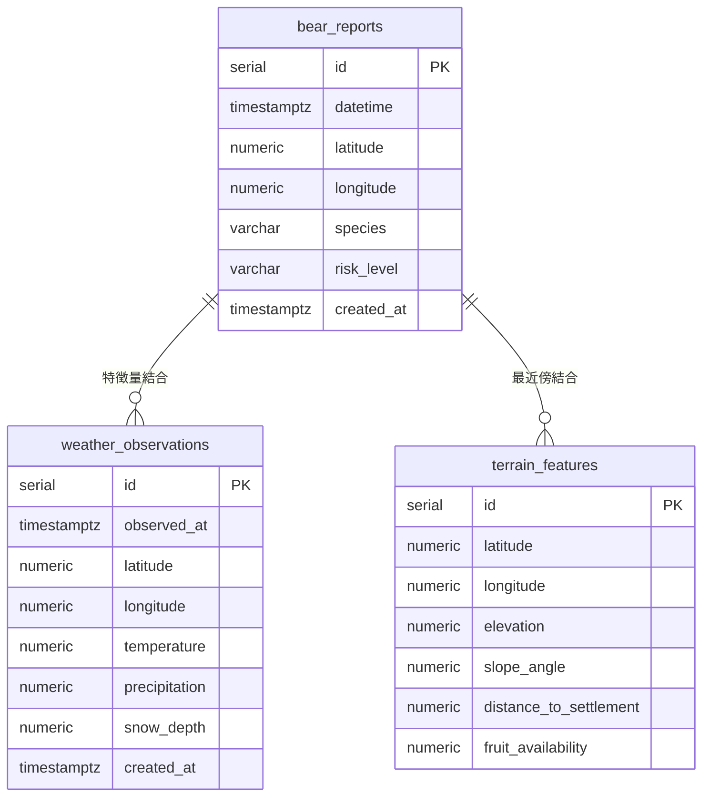

# ER 図

```mermaid
erDiagram
  bear_reports {
    serial id PK
    timestamptz datetime
    numeric latitude
    numeric longitude
    varchar species
    varchar risk_level
    timestamptz created_at
  }
  weather_observations {
    serial id PK
    timestamptz observed_at
    numeric latitude
    numeric longitude
    numeric temperature
    numeric precipitation
    numeric snow_depth
    timestamptz created_at
  }
  terrain_features {
    serial id PK
    numeric latitude
    numeric longitude
    numeric elevation
    numeric slope_angle
    numeric distance_to_settlement
    numeric fruit_availability
  }

  bear_reports ||--o{ weather_observations : "特徴量結合"
  bear_reports ||--o{ terrain_features : "最近傍結合"
```
